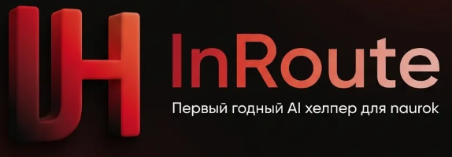

# InRoute Helper: Naurok helper

 
[English](#english) | [Українська](#ukrainian) | [Русский](#russian)| [Media Gallery](./GALLERY.md)

---

## English

### Overview
InRoute Helper is a professional browser extension designed for the naurok.com.ua platform. It automates question parsing and integrates with LLM APIs to provide rapid solutions while maintaining an undetectable presence on the target site.

### Commercial Terms
* **Asset:** Full Source Code (HTML/CSS/JavaScript).
* **Price:** $20.00 USD (One-time payment).
* **Access:** Perpetual (Lifetime).
* **License:** Grant of rights to modify, rebrand, and distribute derived versions.

### Technical Features
* **Multi-LLM Integration:** Supports Gemini and Groq API. Specifically optimized for Groq for maximum inference speed.
* **VLM Image Processing:** Automated image transmission to Vision-Language Models for text extraction.
* **Accuracy Metrics:**
    * **Text & Mathematics (
):** ~90% accuracy.
    * **Visual Content (Images):** ~60% accuracy (limitations due to free-tier neural network constraints).
* **Code Injection:** Deep injection into the target site's JS and CSS environment.
* **Time-Bypass:** Logic to skip or accelerate "Success/Error" animations.
* **Anti-Detection (Tab-Bypass):** Prevents the platform from detecting tab switching.

### Media
* [View Screenshots and Animated Demonstrations (GALLERY.md)](./GALLERY.md)

---

## Українська

### Опис проекту
InRoute Helper - це спеціалізоване розширення для браузера, розроблене для платформи naurok.com.ua. Воно автоматизує парсинг запитань та інтегрується з API нейромереж для отримання швидких відповідей.

### Умови придбання
* **Об'єкт:** Повний вихідний код (HTML/CSS/JavaScript).
* **Вартість:** 20$ USD (Одноразовий платіж).
* **Термін дії:** Безстроковий доступ.
* **Ліцензія:** Права на модифікацію, ребрендинг та розповсюдження похідних версій продукту.

### Технічні характеристики
* **Інтеграція API:** Підтримка Gemini та Groq. Найкраща продуктивність досягається при використанні Groq.
* **Обробка зображень (VLM):** Відправка скріншотів на Vision-моделі для витягування тексту.
* **Показники точності:**
    * **Текст та математика (
):** До 90% точності.
    * **Зображення:** До 60% точності (обмеження через використання безкоштовних нейромереж).
* **Ін'єкція коду:** Пряме впровадження в JS та CSS середовище сайту.
* **Time-Bypass:** Програмне прискорення анімацій результатів тесту.

---

## Русский

### Описание проекта
InRoute Helper - специализированное расширение для браузера, предназначенное для платформы naurok.com.ua. Автоматизирует сбор данных вопросов и взаимодействует с API языковых моделей для мгновенного получения ответов.

### Условия приобретения
* **Объект:** Полный исходный код (HTML/CSS/JavaScript).
* **Цена:** 20$ USD (Единоразово).
* **Права:** Покупатель получает право на неограниченную модификацию, изменение дизайна и перепродажу производных программных продуктов.

### Основной функционал
* **Поддержка LLM API:** Интеграция с Gemini и Groq. Приоритетная оптимизация под Groq для мгновенной генерации ответов.
* **Vision-модуль (VLM):** Передача изображений на VL-модели для распознавания текста.
* **Точность работы:**
    * **Текстовые и математические блоки:** До 90% точности.
    * **Графические материалы:** До 60% точности (обусловлено использованием бесплатных версий нейросетей).
* **Инъекция кода:** Глубокое внедрение в JS и CSS среду целевого сайта.
* **Time-Bypass:** Алгоритм сокращения времени на анимации "Успех/Ошибка".

### Медиа
* [Скриншоты и анимированные демонстрации (GALLERY.md)](./GALLERY.md)

---

## Contact
[Insert Link to Telegram / Discord]
