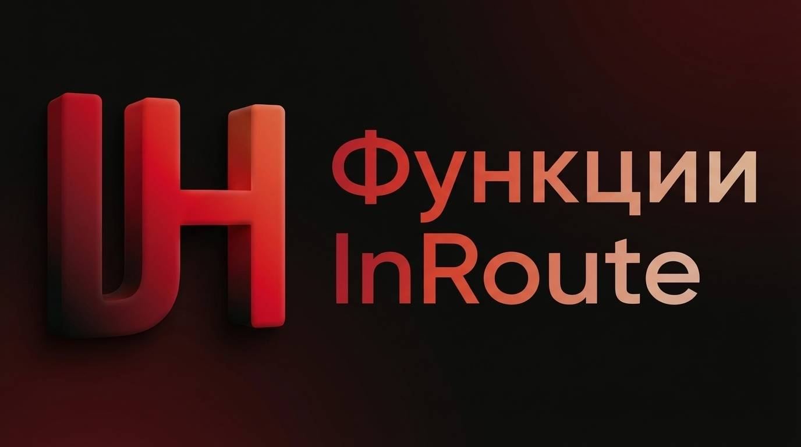

# InRoute Helper — Naurok Helper

InRoute Helper - Помічник, за допомогою якого можна з легкістю проходити завдання.
Все для студентів.

Язык / Мова: [Русский](./README.md) | **Українська**

---

### Функції

* **Інтеграція LLM API:** Підтримка Gemini та Groq. Найкраща швидкість — через Groq.
* **Vision-модуль (VLM):** Передача зображень на VL-моделі для розпізнавання тексту.
* **Авто-детекція:** Розширення самостійно виявляє вміст сторінки та витягує запитання без ручної взаємодії.
* **AI Debug:** Відображає витрачений час на генерацію та кількість використаних токенів у реальному часі.
* **Автовхід:** Автоматично входить у тест — без ручного запуску.
* **Ін'єкція коду:** Пряме впровадження у JS та CSS середовище сайту.
* **Time-Bypass:** Програмне прискорення анімацій результатів тесту.
* **Точність:**
    * Текст та математика — до **90%**
    * Зображення — до **60%** *(обмеження безкоштовних нейромереж)*

---

### Ціна

| Параметр | Деталі |
|---|---|
| **Об'єкт** | Повний вихідний код (HTML / CSS / JavaScript) |
| **Вартість** | $60.00 USD (Litecoin) — одноразово |
| **Доступ** | Безстроковий |
| **Ліцензія** | Права на модифікацію, ребрендинг та розповсюдження похідних версій |

**Litecoin:** `LPtHYyDmJUe9inA5uqGRrDysJ9G4dvdp1k`
**Discord:** `gaondon55453`
